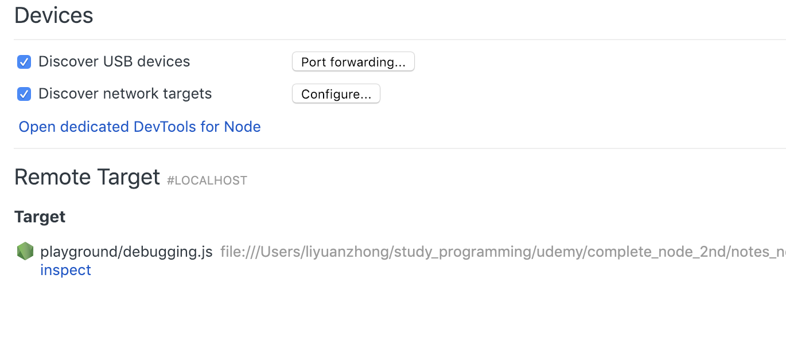

### Yargs
```javascript
console.log('yargs: ', yargs);
```

```bash
node app.js add --title=secrets

# 結果
yargs:  { _: [ 'add' ], title: 'secrets', '$0': 'app.js' }
```

### node inspect
```bash
node inspect file_name
nodemon inspect file_path

#結果
debug>
(function (exports, require, module, __filename, __dirname) {
  ...
}

# debugger;の部分まで読み込まれる
debug> c

#結果表示と内容編集
debug> repl
```

### node inspect by chrome
```bash
node --inspect-brk file_path
nodemon --inspect-brk file_path
```
chrome://inspectにアクセス

